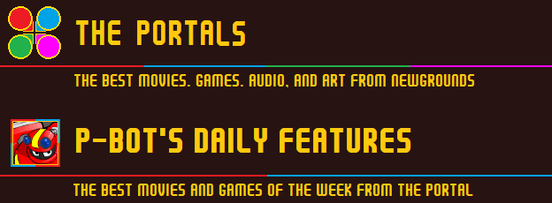

[.text-justify]
= {sp}
:data-uri:
:noheader:

[.text-center]
"THE TANK TRIBUNE NEEDS MORE TAGLINES" +
@!The-Great-One

   <add video here manually>

[.underline]
**LETTER FROM THE EDITOR**

Good Morning Newgrounds! A new show called link:++https://tv.apple.com/us/show/central-park/umc.cmc.4qe3i11erof30x0vz8nwnjkw3++[Central Park] has hit Apple+ Tv.

=== {sp}
{sp} +

{sp} +

{sp} +

image::phonograph.png[]

[.text-center]
**THEME SONG BY** @!sorohanro

{sp} + 

[.text-center]
=== {sp}
[discrete]
==== [.underline]#FEATURED COMPOSERS#
@!Vista-Sound13 @!Quippic8 +

{sp} +

==== https://www.patreon.com/posts/63739050[UPCOMING COMPOSERS]

=== {sp}
{sp} +

{sp} +

{sp} +

{sp} +

[discrete]
=== https://www.newgrounds.com/bbs/topic/1496106[Best of February 2022]

The votes were counted by P-Bot and the tally is in! The Best of February have been announced! Congratulations to @!scumhouse, @!sugarpolyp, and @!theStyg for **A Very Satina Christmas** winning Best Movie! Congratulations to @!Much-Bigger-Rena and @!DVa-Clock, with music track The Dictator by @!jasont01 for Deal with Putin winning Best Game. Congratulations to @!BarlonMando for Best Audio of February for Pure Moods. Congratulations to @!Fropomolo for Best Art of February for Bad Dreams.

[.underline]
[discrete]
=== BEST MOVIE

https://www.newgrounds.com/portal/view/832106

[.underline]
[discrete]
=== BEST GAME

https://www.newgrounds.com/portal/view/834224

[.underline]
[discrete]
=== BEST AUDIO

https://www.newgrounds.com/audio/listen/1114694

[.underline]
[discrete]
=== BEST ART

https://www.newgrounds.com/art/view/fropomolo/bad-dreams

[discrete]
=== https://www.newgrounds.com/bbs/topic/1495884[Super Raft Boat Art Contest Winners!]

@!JasoonMargoon has announced the winners of the **Super Raft Boat Art Contest**. First Prize went to @!Ozrk for their entry Helveti. Congratulations! You can check out all of the entries here.

image::srb.webp[]

[discrete]
=== https://jtvister.newgrounds.com/news/post/1254363[NEWGROUNDS DOES NOT CARE ABOUT COMICS]

@!JTvister is a comic artist here who works on a series entitled https://jtvister.newgrounds.com/news/post/1231502[BONEMEAL]. Posting comics through the Art Portal is troublesome if someone wants to read your comics or if you want to update them. JTvister has made a guide to help comic artists out. They have also made an update with the assistance of @!Epithetsoup and @!The-Great-One. If you're a comic artist looking to add some structure to your comics for availability, then check this out.

[discrete]
=== https://www.newgrounds.com/playlists/view/126bb366ca34345b21db5e3fc7f545f9[School Days]

To celebrate @!Vista-Sound13 even more. He has a collection of songs entitled **School Days**. Two of them you can hear in this morning's Phonograph, or in their own dedicated playlist in the @!Archive!

=== {sp}
{sp} +

{sp} +

{sp} +

We start the week off [...text...] and a listing is below

https://www.newgrounds.com/portal/view/835097

=== {sp}
{sp} +

{sp} +

{sp} +

Here are the Top 5 songs ranked by Popularity.

https://www.newgrounds.com/audio/listen/1116007

=== {sp}
{sp} +

{sp} +

{sp} +

This week's featured artist is @!BeepBoRobloxBro. They've been on Newgrounds for almost a year now. They like the styles of 1930s and 2000s cartoons. Check out their works below!

[.text-center.underline]
**A Smol Crazy Pencil**
[.text-center.bold]
**BeepBoRobloxBro**

https://www.newgrounds.com/art/view/beepborobloxbro/john-captain-tankmen

=== {sp}
{sp} +

{sp} +

{sp} +

[discrete]
== SUPPORTER OF THE WEEK
[discrete]
=== @!FUNKbrs

FUNKbrs has been with the site since 2000 and a Supporter since 2016. A musician, former moderator, realist, and one of the kindest users on the site. Despite his many threads promoting hatred. He is a friend to many, those lucky enough to be called that. We thank you FUNKbrs for all the love you have given Newgrounds for over twenty years.

[quote]
P.S. I love you <3 The-Great-One

[discrete]
=== PARTY CHITCHAT

https://www.newgrounds.com/bbs/topic/1407508[Welcome to the supporter forum!]

A lot of users become supporters, but don't drop by the Party. Stop in and introduce yourself!

{sp} +

https://www.newgrounds.com/bbs/topic/1422135[Why Did You Support Newgrounds]

A thread made early in the Supporter launch. What made you want to purchase a Supporter upgrade and give your hard earned money to Newgrounds?

* https://www.newgrounds.com/bbs/topic/1454212[Is there family for FUNKbrs here?]
* https://www.newgrounds.com/bbs/topic/1430852[Supporter Goals]
* https://www.newgrounds.com/bbs/topic/1452988[🍻The Supporter Lounge's Lounge 🍺]

=== {sp}
{sp} +

{sp} +

{sp} +

**“04/01/2022”** +
@!GDjkhp

=== {sp}
{sp} +

{sp} +

{sp} + 

[discrete]
== LATEST INTERVIEW: ninjamuffin99

If you missed the last interview it was with ninjamuffin99. The creator behind Breathing Simulator and one of the creators behind FRIDAY NIGHT FUNKIN'. The latest Patreon interview is up now.

[discrete]
=== PATREON INTERVIEW: Interview with Butzbo!

{sp} +

{sp} +

[discrete]
== [.underline]#ARTIST NEWS#

[discrete]
=== Updates and venting...

@!TerrorByte had their team place 3rd in their state's BPA Convention. They're not sure if they'll make nationals or not. They're looking to get their works more noticed. TerrorByte is a bit shy about their art though. Take a look at when you get a chance.

[discrete]
=== Lonely Love Spider Available at Bandcamp

@!CIEIRMusic has a new album out! It took a long time to work on and has a friendly Goth approach. Drawing inspiration from Tim Burton. It also comes with a free digital copy of CIEIRMusic's painting.

[discrete]
=== 200 FANS!!!!

@!DemisurgeX has hit 200 Fans! 

[discrete]
=== Mark your Calendars! March 25+26

@!Comick will be featured in this year's Latinx Comic Arts Festival. 

[discrete]
=== NEW CARTOON + COMIC OUT NOW!

@!mikelzNG released his new cartoon entitled Dr. Rock.

[discrete]
=== New Comic & Music Out Now!

@!illwillpress has new Foamy Music and a new Foamy Comic out! Check them out!
Monthly Update February 2022

@!BenTibbetts has a monthly update. 

[discrete]
=== New project and a little announcement!!!

@!TemptyOne has been hard at work on multiple projects.

[discrete]
=== March Updates - NGA / GDC / Robeats / Welkin/Skyworld game!

@!Waterflame has posted some updates. 

=== {sp}
{sp} +

{sp} +

{sp} +

[.text-center]
image::impossible_quiz.png[]

https://www.newgrounds.com/portal/view/365143

15 years ago, one of the most excruciating, random, difficult, and trolling games of all time debuted on Newgrounds. @!Splapp-me-do gave us The Impossible Quiz. If you want a game that will make you rage, then this is the one to bring your blood to a boil. I will give this tidbit to new players. Try not to use your Skips. That is all I will say.

{sp} +

**_"See how many questions you can answer before it's Game Over. Sounds simple? Think again... the questions are BASTARD hard and require obscure insane logic, super fast reactions or just pure luck to answer correctly.
It's not actually impossible though, just really really hard. GOOD LUCK! Mwahahah! :p"_**
[.text-right]
@!Splapp-me-do +
February 20, 2007

=== {sp}
{sp} +

{sp} +

{sp} +

[discrete]
== [.underline]#NEW USERS#

@!Brody-foxxThe-hedgeh joined last year, they just now said hello in the Intro Thread. He's a new artist here on the site, getting more into Newgrounds. Check out his art below!

@!CardboardMarty is a creator that joined us recently. He's heard great things about Newgrounds and is excited to share his works with us! Check them out below!

@!Spunfreak325 just joined us. They're a self-described freak and geek. Say hello in the Intro Thread!

{sp} +

{sp} +

[discrete]
== STORIES

{sp} +

[discrete]
=== \My birthday… yay?

@!EchoTense01 celebrated his birthday. His Newgrounds Anniversary is coming up as well! Tomorrow he will be on Newgrounds for one whole year! Be sure to wish him a Happy Birthday and congratulate him on his Newgrounds Anniversary!

{sp} + 

[discrete]
=== Show NG Your Home Screen

@!Seth wants to see your home screen from your phone. Doesn't matter what phone you use. This is also a great reminder that you can browse Newgrounds on your phone wherever you are!

{sp} + 

[discrete]
=== Fill me in on the Newgrounds Lore

@!Azeleon is looking to learn more about the lore of Newgrounds! The history, characters, and people that have shaped the site into what it is today! Share some of your favorite historical moments from Newgrounds!

{sp} +

{sp} +

[discrete]
== [.underline]#QUOTES OF THE WEEK#

"I have devoured many of the unborn" +
@!Gremlin

{sp} +

"Sorry I forget to change the toilet paper, god I'm such a terrible NG janitor" +
@!InfernoPhoenixNG

{sp} +

[discrete]
=== link:++https://www.newgrounds.com/bbs/topic/1441088/5#bbspost27245092_post_text++[PIC OF THE WEEK]

@!Nabella

=== {sp}
{sp} +

{sp} +

{sp} +

[discrete]
=== https://www.newgrounds.com/bbs/topic/1398018[Front Page Suggestion Thread]

Back in 2015, Tom Fulp wanted the forums to talk more about Newgrounds. @!Bit decided that we should share what we feel should be on the front page. From any portal on the site. A lot of great finds have been showcased on the front page of the site because of this thread. If you found something in the Portal that you liked, then share it in this thread. Tom may put it on the front page!

=== {sp}
{sp} +

{sp} +

{sp} +

Here we take a look through the favorites of our readers here on The Tank Tribune. This week we have ten favorite movies from @!PurpleShoes. Enjoy!

[discrete]
=== PurpleShoes Favorite Movies

=== {sp}
{sp} +

{sp} +

{sp} +

Here are the Users of the Day for March 6th - March 12th. Congratulations to all of you!

=== @!STANNco
=== @!Much-Bigger-Rena
=== @!JoeSketchConcepts-NG
=== @!antdung
=== @!Komix
=== @!LobsterMango
=== @!Schizophist

{sp} +

{sp} +

While I was browsing Newgrounds, I did come across a lot of joy and happiness. Closing statement.

{sp} +

{sp} +

[.text-center]
=== {sp}
**The Tank Tribune is a part of Dohn's Desk Productions** +
**[ https://www.patreon.com/dohnsdesk[SUPPORT ON PATREON] | https://www.newgrounds.com/supporter[SUPPORT NEWGROUNDS] ]**

